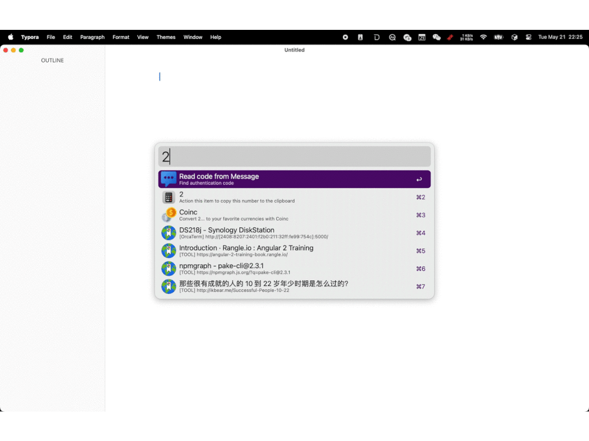

# 2FA-Read Code

> Read authentication code in your recent messages or current clipboard

1. Type `2fa` to trigger workflow
2. Type`⌘ C` or `⏎` to copy captcha

## Requirement

1. `brew install node`
2. Alfred has permission to `Full Disk Access`
3. sqlite3 >=v3.33.0

## Big Sur Issue

update sqlite by brew

<!-- more -->

## Screenshots

