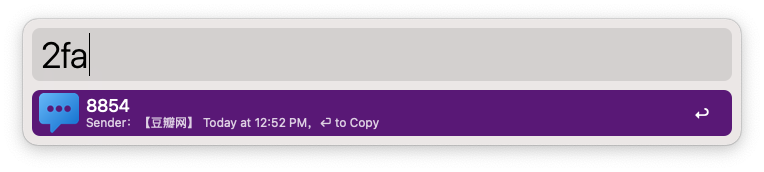

> Read authentication code in your recent messages or current clipboard

1. Type `2fa` to trigger workflow
2. Type`⌘ C` or `⏎` to copy captcha

## requirement

1. `brew install node`
2. Alfred has permission to `Full Disk Access`

## upgrade sqlite3 issue

> Perhaps the built-in SQLite3 version on Mac is too low and does not support JSON output, so it is necessary to upgrade it using Homebrew.

1.check json support
  sqlite3 -json
2. create symbolic link 
ln -sf /usr/local/Cellar/sqlite/[version]/bin/sqlite3 /usr/local/bin/sqlite3
3. export PATH="/usr/local/bin:$PATH"

<!-- more -->

## screenshots

