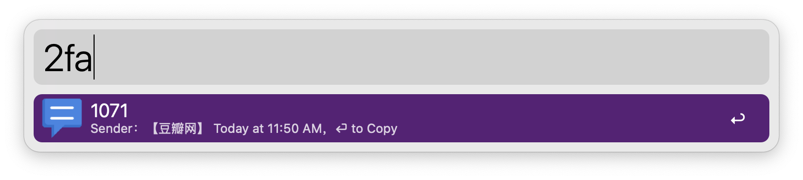
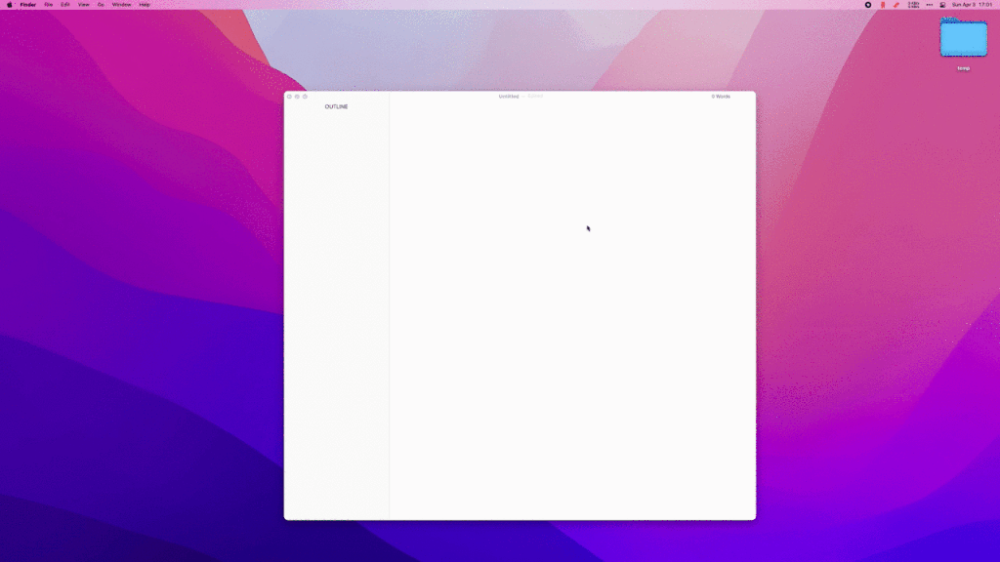

> Read authentication code in your recent messages or current clipboard

1. Type `2fa` to trigger workflow
2. Type`⌘ C` or `⏎` to copy captcha
3. Type `:update2fa` to update workflow
## requirement

1. `brew install node`
2. Alfred has permission to `Full Disk Access`

<!-- more -->

## screenshots

