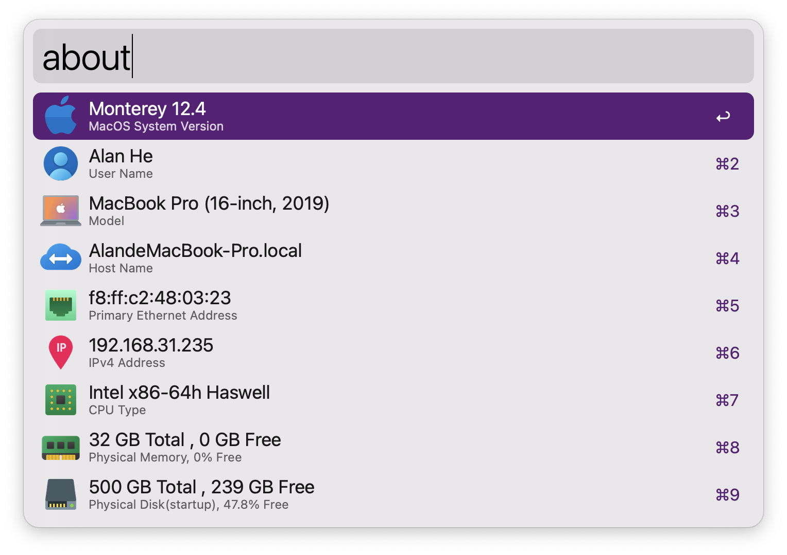

# About Mac
> Displays system information about your Mac.
Contains UserName、Model、HostName、Primary Ethernet Address、IPv4 Address、MacOS、CPU Type、Physical Memory、Storage、Locale、Display Resolution、Display System Uptime、Serial Number、Battery Health.

1. Type `about` to trigger
2. Type `⏎` to copy info
3. Large type support

<!-- more -->

### screenshots

