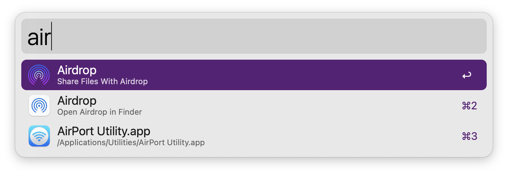
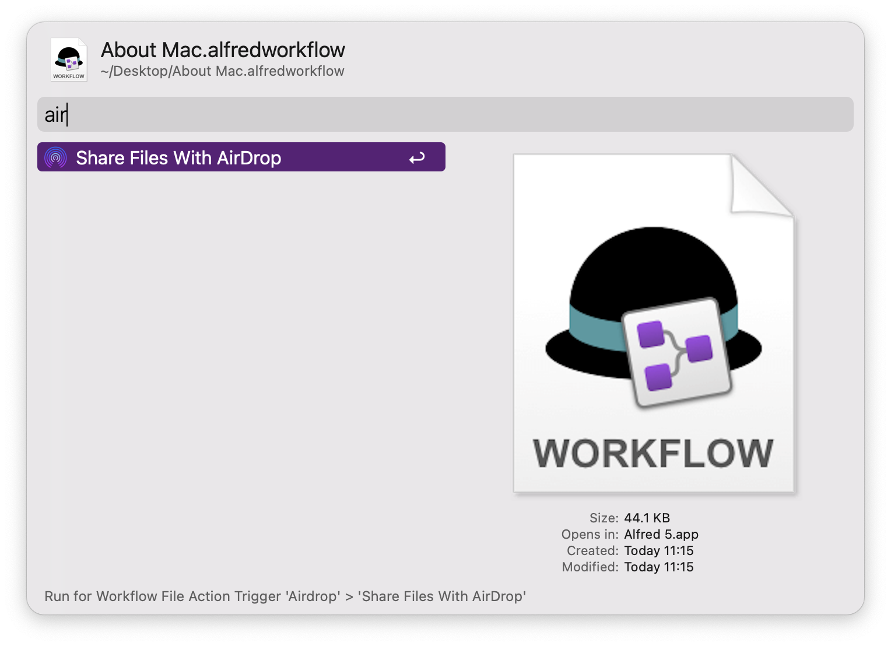

> One click to evoke airdrop and send the selected something to the target device

- Currently only supports English and Simplified Chinese
- You can share file、photo、url.
- Support File Action
  - Support multi file selection.

Support Catalina、Big Sur

<!-- more -->

## screenshots

