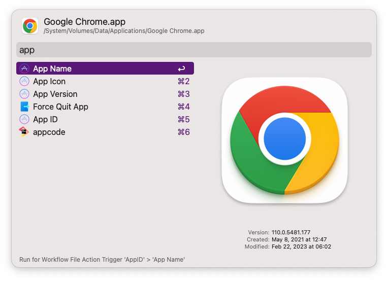

> Getting Bundle ID, Release Version Number, App icon of apps

## Requirement

`brew install node`

## Usage

1. `appid` to get Bundle ID of apps
2. `av` to get Bundle version of apps
3. display app is from appstore or not
4. Universal action support
	- `App ID` get id of app, type `enter` to copy
	- `App Version` get version of app，type `enter` to copy
    - `App Name` get name of app，type `enter` to copy
    - `App ICON` copy icon of app, type `command enter` to reveal in finder.

<!-- more -->
## Screenshots

