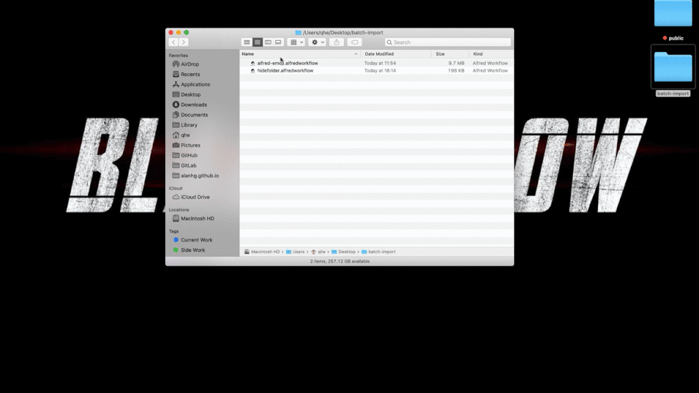

Select the folder and import workflows in batches

## install
- NodeJS

<!-- more -->
> Batch import workflows. just select folder which contains multi workflows and execute batch import file action.

## Requirement
- NodeJS

