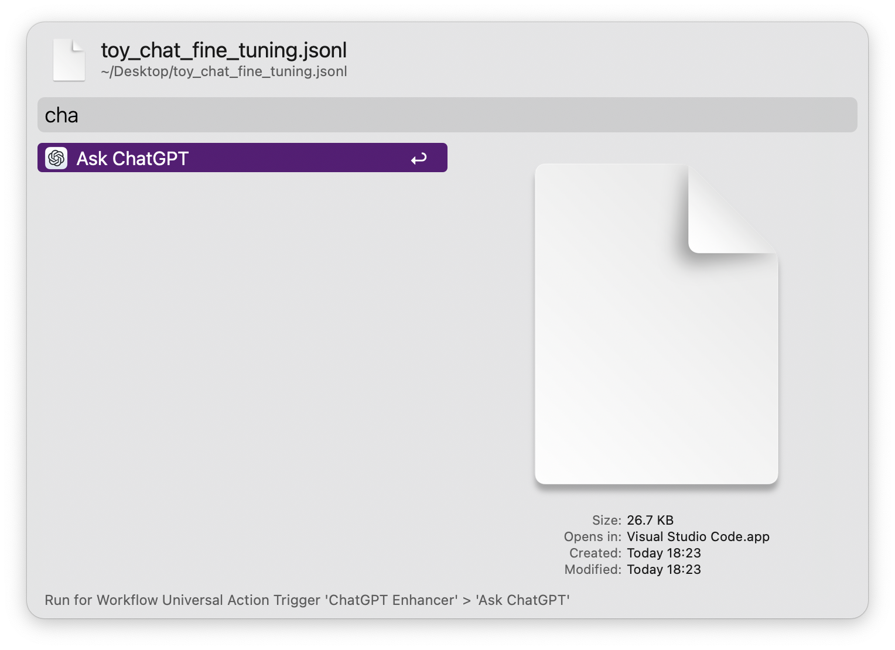
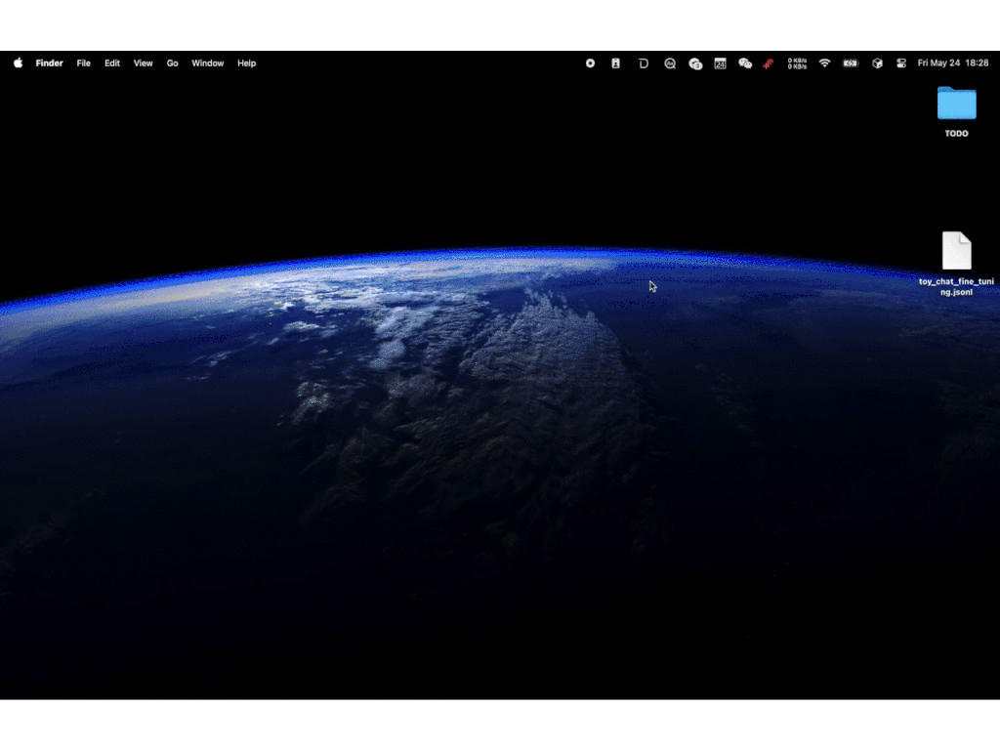

> Make ChatGPT more productive by providing quick access and enhanced functionality.

## Requirement

install ChatGPT App

link: https://persistent.oaistatic.com/sidekick/public/ChatGPT_Desktop_public_latest.dmg

## Feat
1. fallback search.
2. select any texts/files/urls, trigger universal action.
3. hotkey `⌥ ⌘ G` to trigger App.

## Screenshots

<!-- more -->
