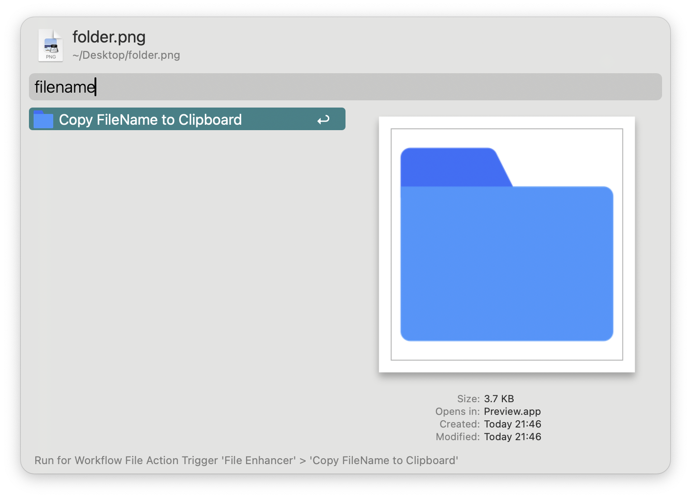
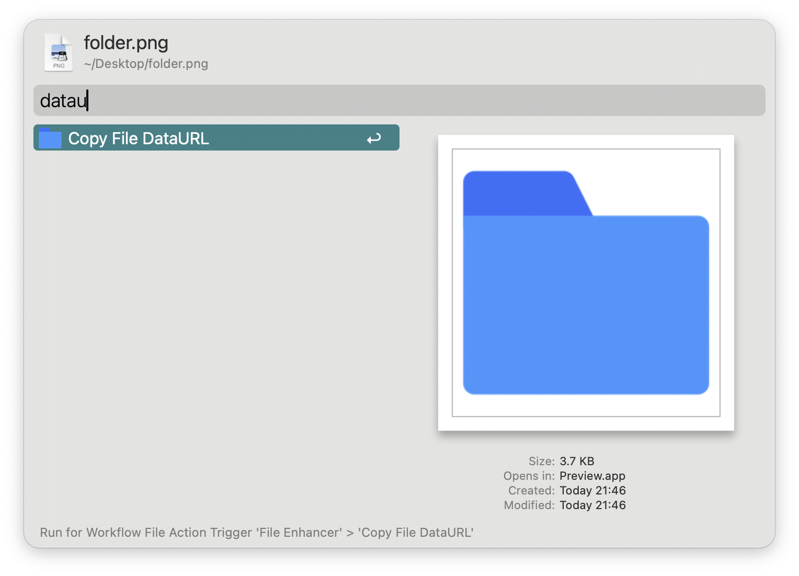

> Effortlessly copy your file name, size, and data conversion.


## Requirement

```
brew install imagemagick

```

## Feat

1. Copy FileName without suffix to clipboard
2. Copy FileSize to clipboard
3. Convert file to DataURL and copy to clipboard


[](https://github.com/alanhe421/alfred-workflows/raw/master/file-enhancer/File%20Enhancer.alfredworkflow)


<!-- more -->

## ScreenShots




