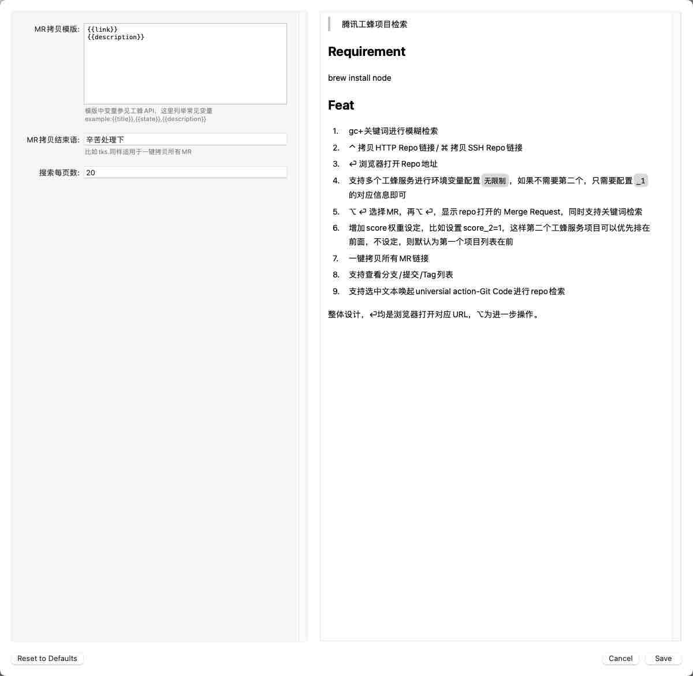

> 腾讯工蜂项目检索

## Requirement

brew install node

## Feat

1. gc+关键词进行模糊检索
2. ⌃ 拷贝HTTP Repo链接/ ⌘ 拷贝SSH Repo链接
3. ⏎ 浏览器打开Repo地址
4. 支持多个工蜂服务进行环境变量配置`无限制`，如果不需要第二个，只需要配置`_1`的对应信息即可
5. ⌥ ⏎ 选择MR，再⌥ ⏎，显示repo打开的 Merge Request，同时支持关键词检索
6. 增加score权重设定，比如设置score_2=1，这样第二个工蜂服务项目可以优先排在前面，不设定，则默认为第一个项目列表在前
7. 一键拷贝所有MR链接
8. 支持查看分支/提交/Tag列表/AI设置
9. 支持选中文本唤起universial action-Git Code进行repo检索

整体设计，⏎均是浏览器打开对应URL，⌥为进一步操作。

<!-- more -->

## Configuration

