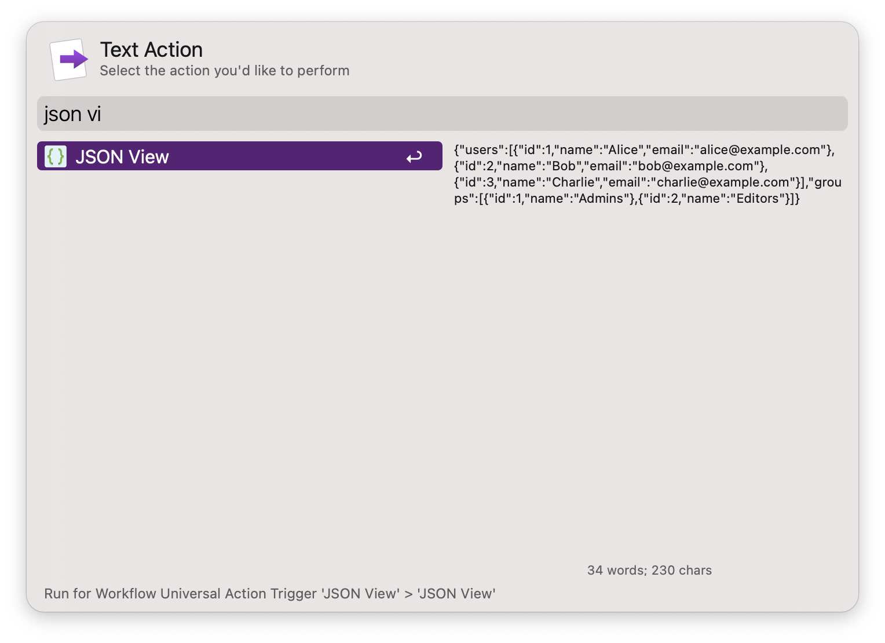

> Format json text with one click

## Requirement

```
brew install jq
```

## Usage

1. Select some text and trigger universal action.
2. `enter` to preview formatted json.
3. `⌘ enter` to copy the formatted json.
4. Type `jsonview` keyword to trigger the action with clipboard.


[](https://github.com/alanhg/alfred-workflows/raw/master/json-view/JSON%20View.alfredworkflow)
[](https://raw.githubusercontent.com/alanhg/alfred-workflows/master/json-view/src/info.plist)


<!-- more -->





