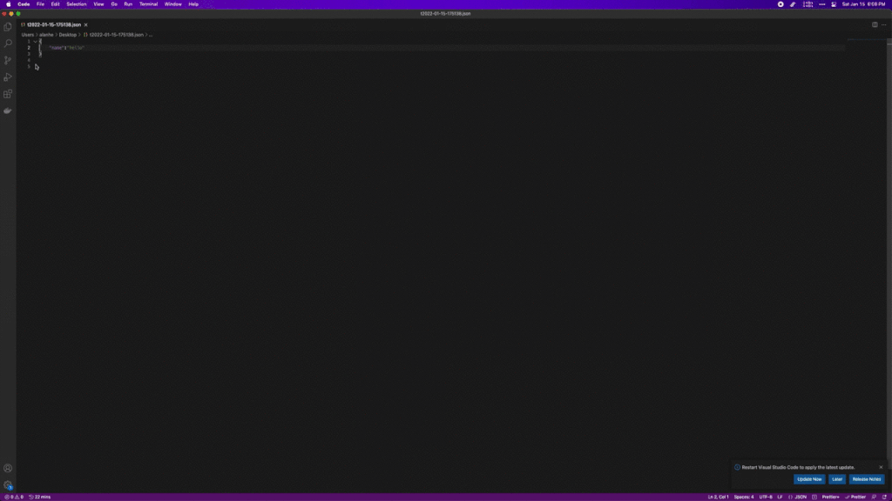

> generate TypeScript interfaces from JSON. you can choose prefer interface instead of type.

thanks json-ts package.

## Usage

JSON text select and trigger json2ts universal action.

<!-- more -->

## support customize

