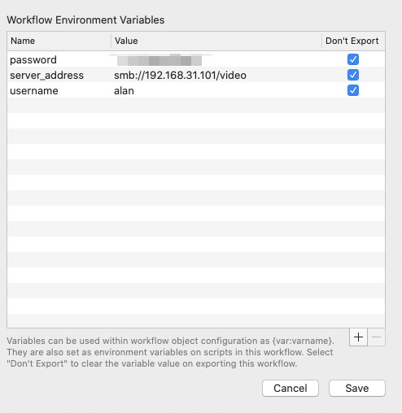

> Connect to server quickly. Mount and Open volume.

Network like SMB/CIF、NFS 和 FTP。

@see https://support.apple.com/guide/mac-help/network-address-formats-and-protocols-on-mac-mchlp1654/11.0/mac/11.0

<!-- more -->

## screenshot

## get start
    
1. set environment variable
2. tap keyword 'mount'

    

