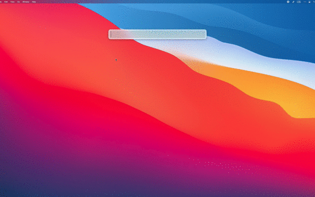

Quickly create target type file

You can configure the file generation path in environment variables

<!-- more -->
> Quickly create target-type file, directory also support.

You can configure the file generation path in environment variables

