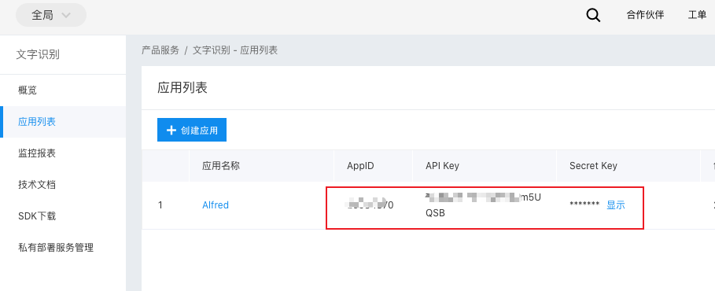
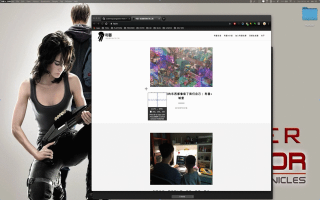

Get the text in the screenshot to the clipboard

First run this command on a terminal:

1. brew install pngpaste
2. npm install baidu-aip-sdk -g

<!-- more -->

登陆百度智能云，选择文本识别，创建应用,将高亮的三个值配置在workflow中即可。

## 效果

