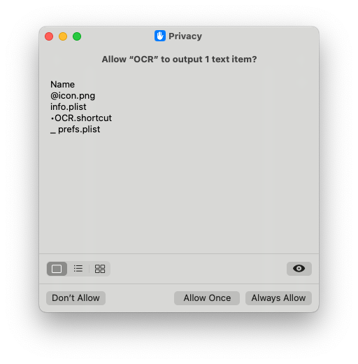

> Get the text in the screenshot to the clipboard

Use the built-in OCR, no need to install dependencies.

<!-- more -->

## 效果

## First-time use

In addition to this, when using it, you will be prompted to install shortcuts. Install and authorize to allow it.

