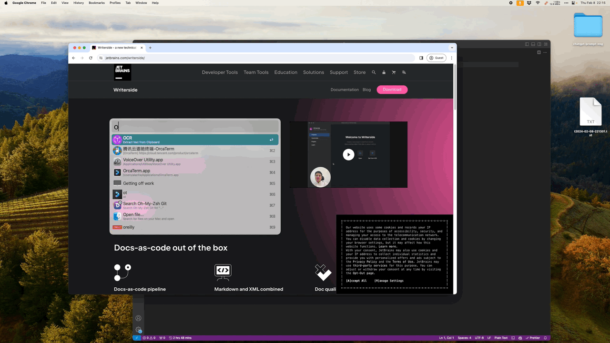
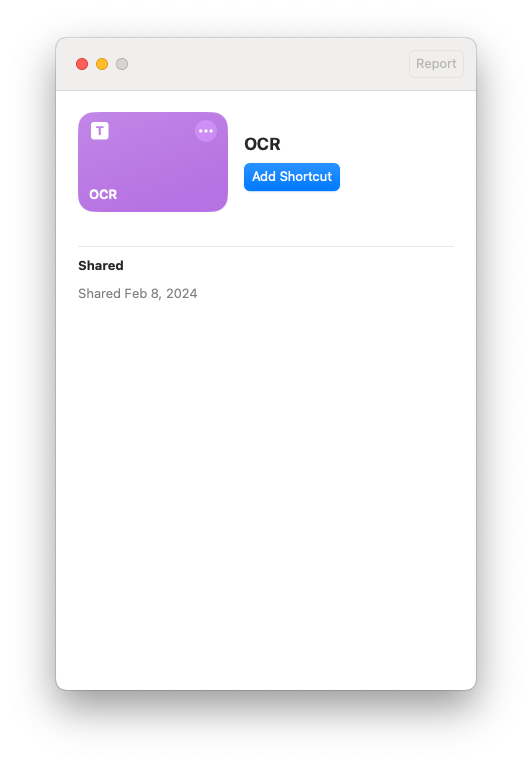

> Activate OCR keywords, select the screen area, and press Enter to immediately obtain the text.

Use the built-in OCR, no need to install dependencies.

1. support hotkey trigger, recommend setting the hotkey to `⌘ ⇧ 7`.
2. type keyword `ocr` to trigger

<!-- more -->

## 效果

## First-time use

In addition to this, when using it, you will be prompted to install shortcuts. Install it.

When re-triggering the ocr, there will be a permission authorization box as follows. Click allow, and then you can use it normally.

## Hotkey
You can change it in the workflow settings. Recommend setting the hotkey to `⌘ ⇧ 7`.

