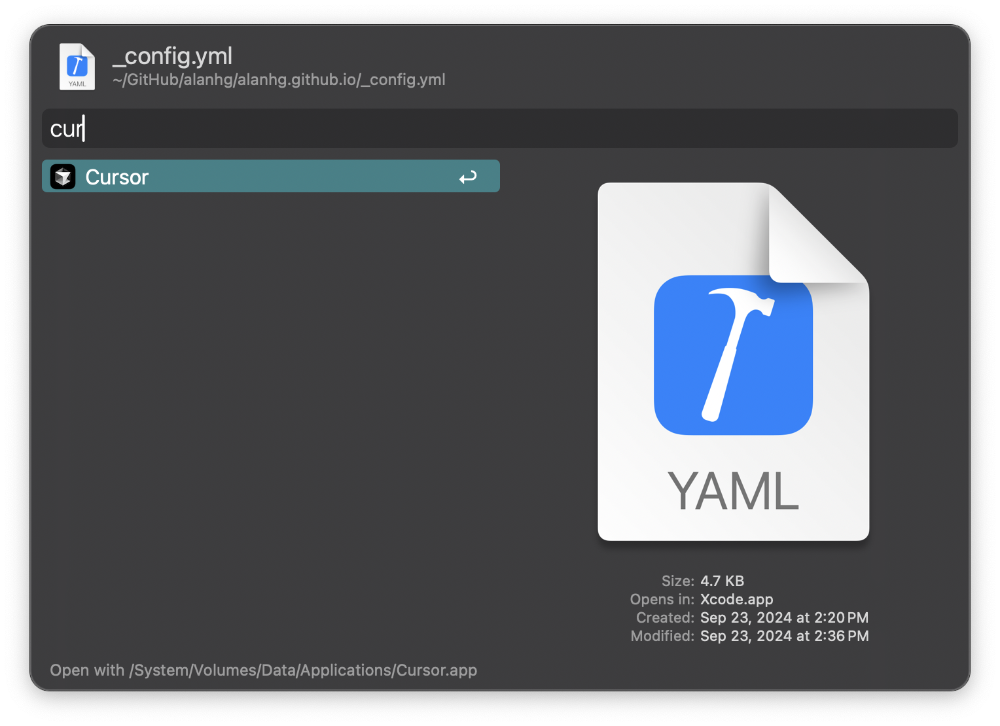

> Select any file in Finder, and with a single click, access the “Open With” option to choose any application for opening the file.

## Usage

hotkey:<kbd>⌘</kbd><kbd>⇧</kbd><kbd>O</kbd>

<!-- more -->

## ScreenShots

