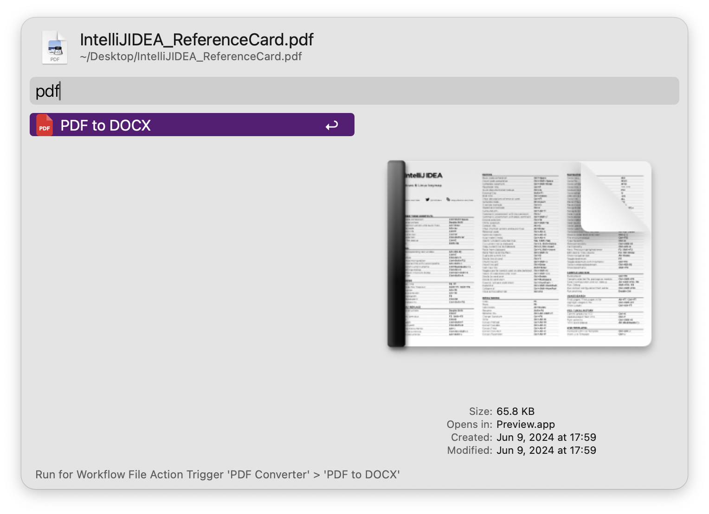

> convert pdf file to docx
## Requirement

```
pip install pdf2docx

```


## Usage

1. select pdf file and trigger file action.


[]()
[](https://github.com/alanhe421/alfred-workflows/raw/master/pdf-converter/PDF%20Converter.alfredworkflow)


<!-- more -->

## Screenshot


