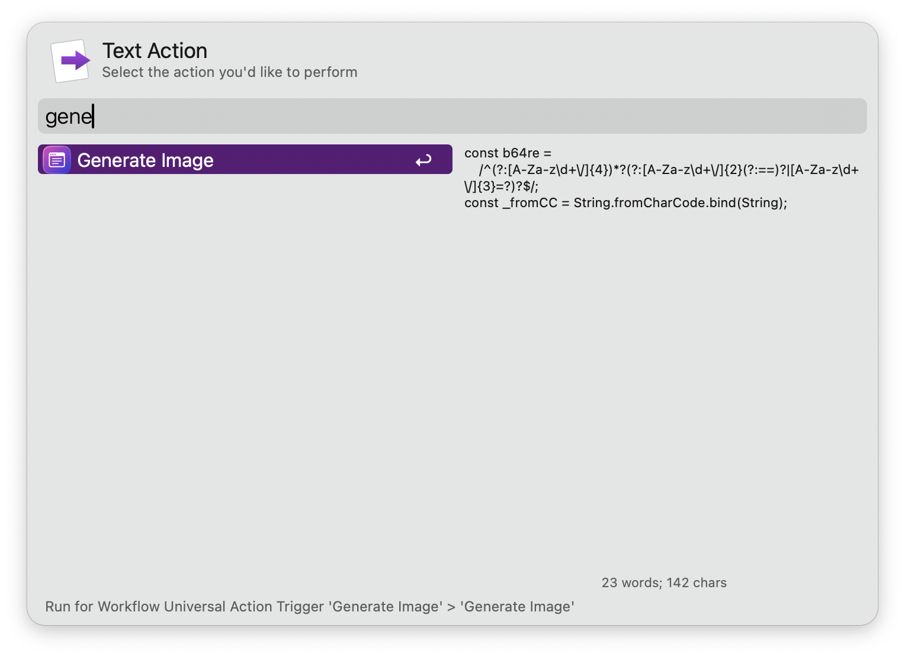
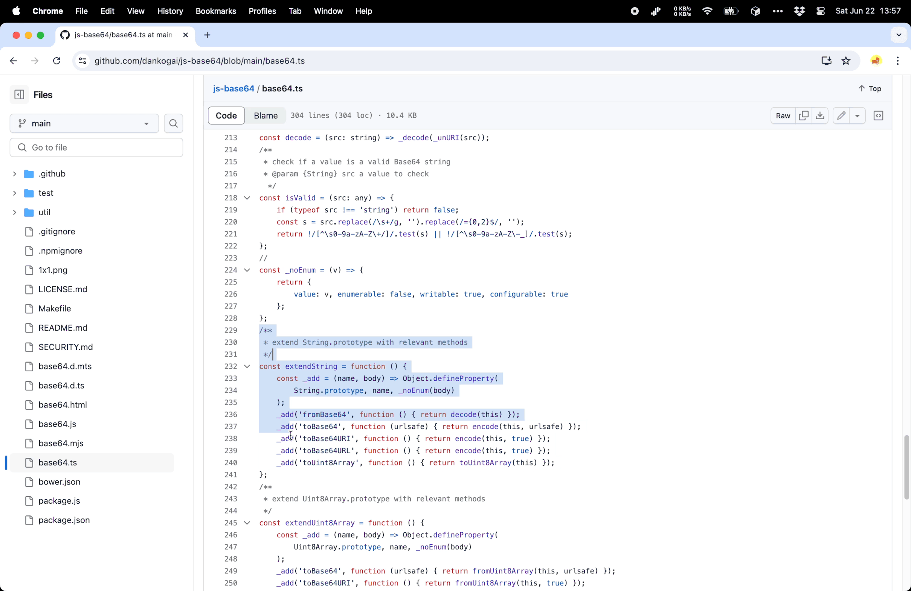

> Create beautiful images of your code. Rewritten with reference to the official Raycast plugin.

## Setup
You can configure the theme, background, etc. of the generated images in the workflow configuration or simply use the default.

## Usage

1. Select some code and trigger universal action named `Generate Image From Selected Code`.
2. Modify the configuration on the opened ray.so page and click export.

## Reference

https://github.com/raycast/extensions/tree/main/extensions/ray-so

<!-- more -->

## Screenshots

