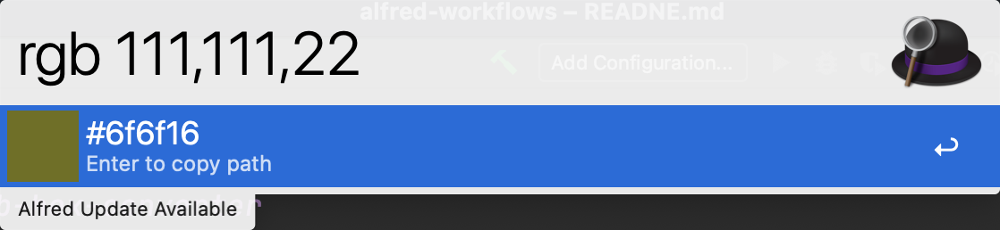
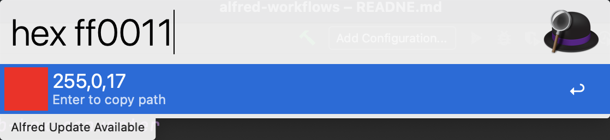

## pre install

```shell

$ npm install canvas

// or

$ yarn install canvas

```


[](https://img.shields.io/badge/version-v1.0-green?style=for-the-badge)
[](https://github.com/alanhe421/alfred-workflows/raw/master/rgb-hex-converter/RGB-Hex%20converter.alfredworkflow)


<!-- more -->
# rgb-hex-converter


## pre install

```shell

$ npm install canvas

// or

$ yarn install canvas

```





