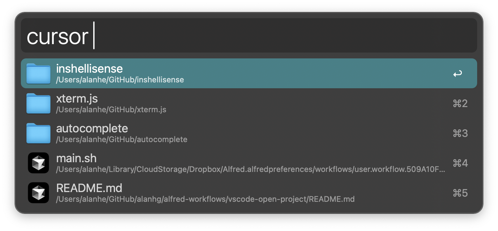
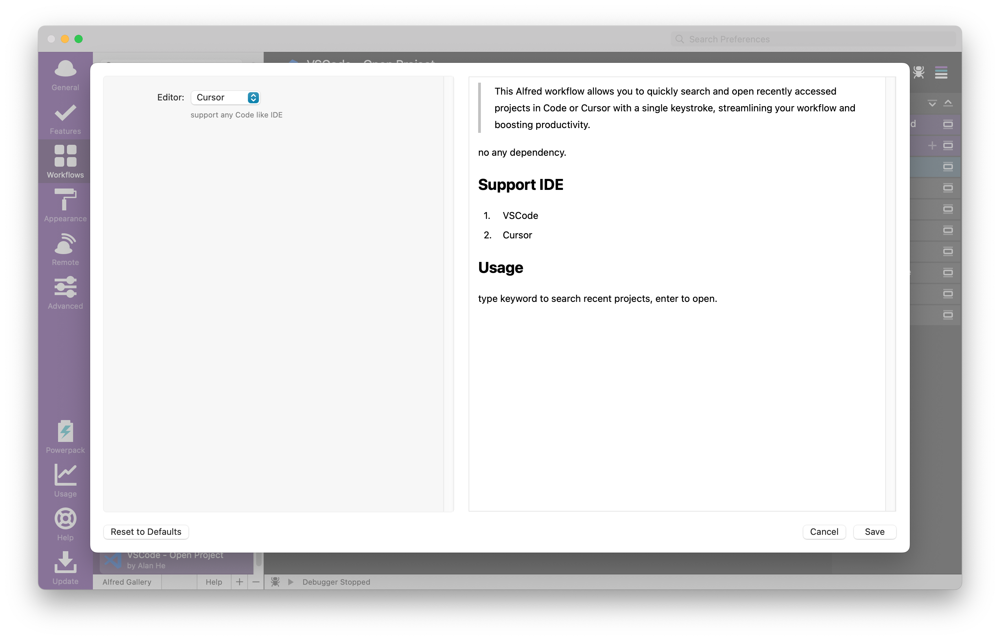

# VSCode - Open Project

> This Alfred workflow allows you to quickly search and open recently accessed projects in Code or Cursor or any IDE with a single keystroke, streamlining your workflow and boosting productivity.

no any dependency.

## Support IDE

1. VSCode
2. VSCode - Insiders
3. Cursor
4. Antigravity

## Usage

1. Type keyword to search recent projects, enter to open.
2. Open With File Action for any fille.
3. Support whether to open project in a new window.
4. option to open with second editor
5. read more editor support webstorm|phpstorm|idea|pycharm|goland|rider|clion|rubymine|appcode

<!-- more -->

## Screenshots

