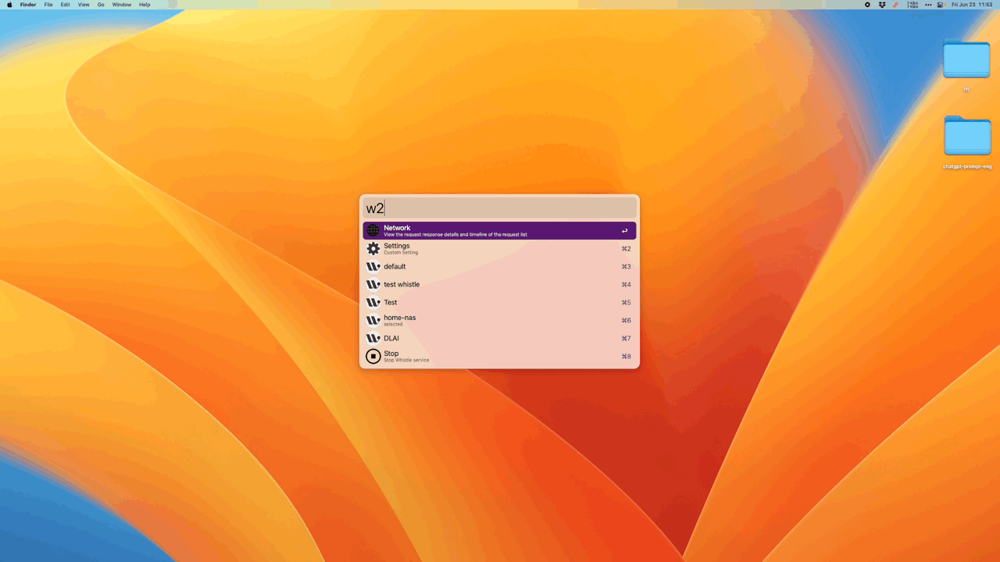

> Quick Switching and Selecting Proxy Rules

## Requirement

1. brew install whistle

## Usage

Type `w2` to trigger.

- `⌥ ⏎`Access the WEB management page.
- `⏎` Toggle the rule selection status.
- `⌘ ⏎` Preview the rule.
- `⌘ C` Copy the specific configuration of the current rule.
- Enter keywords to filter dropdown options, supports Chinese Pinyin search.
- Partial settings [Multiple rule selection [x], Version update check].
- Enter the keyword `selected` to filter rules that match.

## Config
If you need SOCKS proxy, configure SOCKS_PORT.

<!-- more -->

### Whistle Official Doc

- https://wproxy.org/whistle/

## Screenshots

