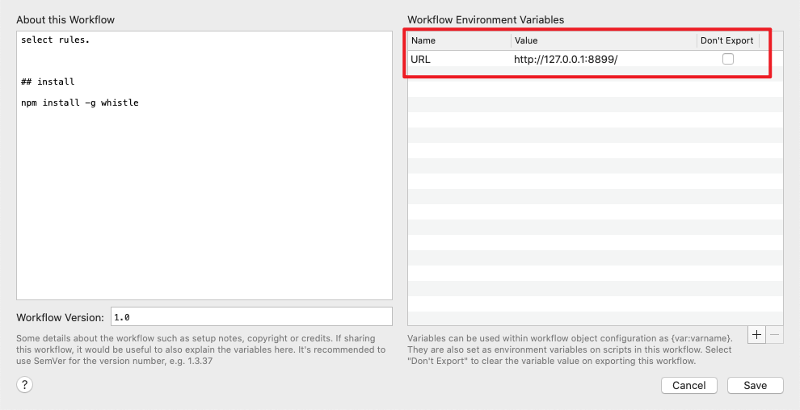

select rules.

## Usage

type w2 to trigger

## install

npm install -g whistle

<!-- more -->
> 快速切换选择代理Rules

- ⌥ ⏎ 访问WEB管理页面
- ⏎ 切换rule选择状态
- ⌘ C拷贝当前Rule具体配置项
- ⇧或⌘ Y或⌘ L进行Rule预览
- 部分设定【规则多选[x]，版本更新检查】

### Whistle官方文档

- https://wproxy.org/whistle/

## 实际效果

## 安装

1. install node
2. npm install -g whistle
3. w2 start 
4. alfred workflow环境变量配置服务地址
    
